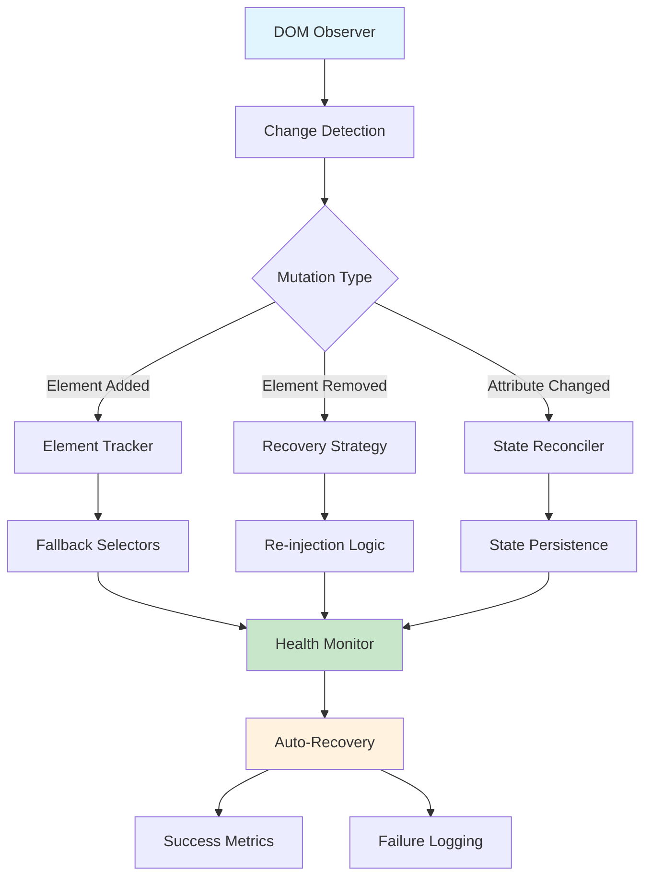
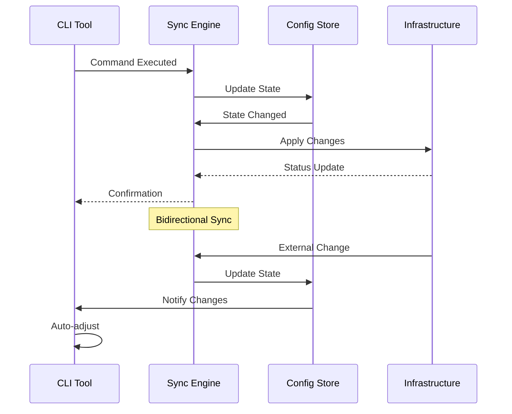
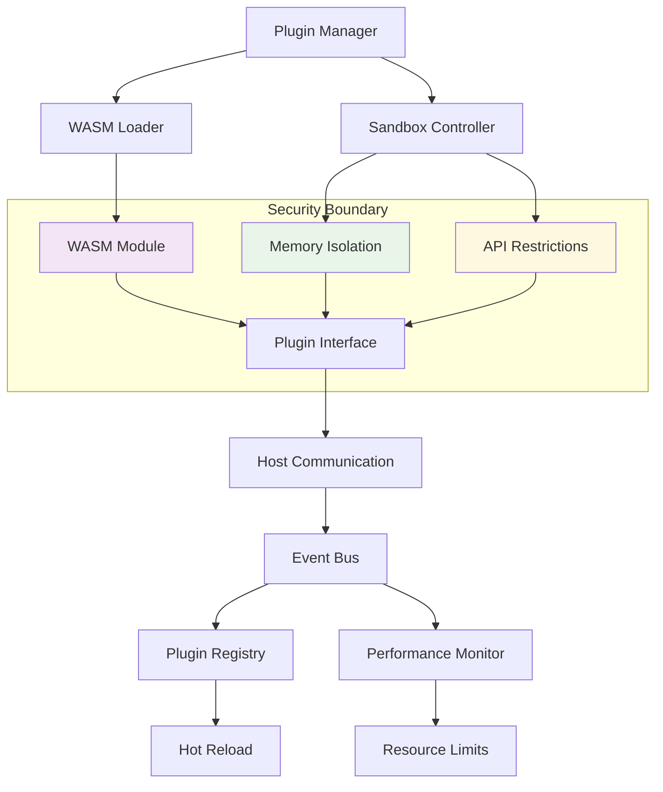
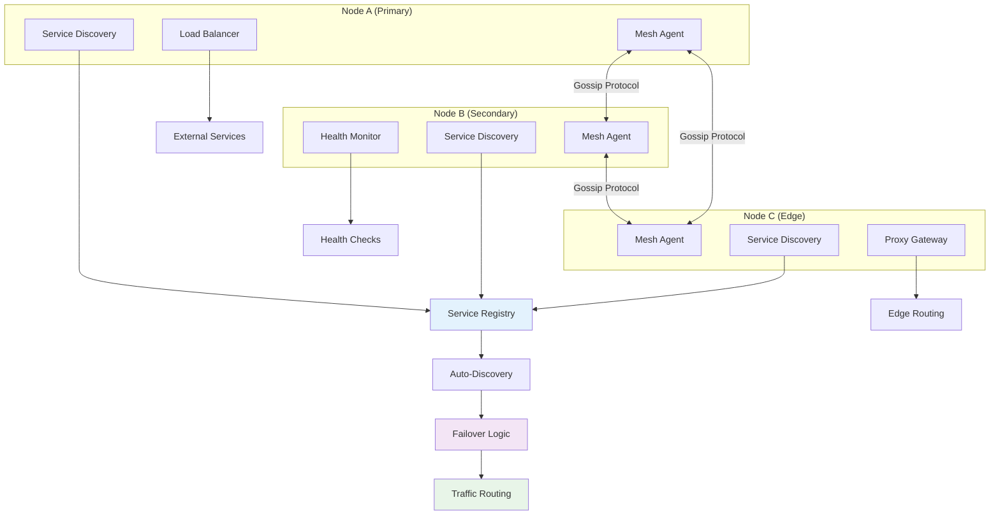

<div align="center">
  
</div>

<div align="center">

# Complexity
⚡ Supercharge your favourite AI Chat web apps

</div>

---

> [!TIP]
> 🎁 **FREE PERPLEXITY PRO!** Sign up, ask your first question on the new Comet browser, and unlock premium features instantly for the first 30 days ➡️ [https://pplx.ai/pnd280](https://pplx.ai/pnd280)

---

> [!NOTE]
> Originally a [Perplexity AI](https://perplexity.ai/) extension, this repository has now been restructured into a suite of enhancements for multiple platforms and services.

## Supported Platforms/Services

### Perplexity AI

<div>
  <p>
    <a href="https://chromewebstore.google.com/detail/complexity/ffppmilmeaekegkpckebkeahjgmhggpj" target="_blank">
      
    </a>
    <a href="https://addons.mozilla.org/en-US/firefox/addon/complexity/" target="_blank">
      
    </a>
  </p>
  <p>
    
    
    
    
  </p>
</div>

- Provides a comprehensive set of added features and UI/UX improvements with excellent modularity and customization
- Supports 22 languages
- [**Supports the new Comet browser**](./perplexity/extension/docs/comet-enable-extensions.md)
- Supports Firefox Android
- Navigate to [`./perplexity/extension/`](./perplexity/extension/) for more information

## NextGen Resilient Features 🚀

### Feature Summary Table

| Feature | Status | Description | Implementation Path | Priority |
|---------|--------|-------------|-------------------|----------|
| **Resilient DOM Layer** | 📋 TODO | Self-healing DOM manipulation with fallback strategies | `src/core/resilient-dom/` | High |
| **CLI/Infra Sync** | 📋 TODO | Bidirectional synchronization between CLI tools and infrastructure | `src/cli-sync/` | Medium |
| **WASM Plugin Runtime** | 📋 TODO | High-performance WebAssembly plugin system with sandboxed execution | `src/wasm-runtime/` | High |
| **Homelab Mesh Mode** | 📋 TODO | Distributed homelab networking with auto-discovery and failover | `src/homelab-mesh/` | Medium |

### Architecture Diagrams

#### 1. Resilient DOM Layer Architecture



**TODO Implementation Stubs:**
- [ ] `src/core/resilient-dom/observer.ts` - DOM mutation observer with smart retry logic
- [ ] `src/core/resilient-dom/strategies/` - Fallback selector strategies
- [ ] `src/core/resilient-dom/health-monitor.ts` - Real-time DOM health monitoring
- [ ] `src/core/resilient-dom/recovery.ts` - Automated recovery mechanisms

#### 2. CLI/Infra Sync Flow



**TODO Implementation Stubs:**
- [ ] `src/cli-sync/engine.ts` - Core synchronization engine
- [ ] `src/cli-sync/adapters/` - CLI tool adapters (docker, kubectl, terraform, etc.)
- [ ] `src/cli-sync/config-store.ts` - Centralized configuration management
- [ ] `src/cli-sync/webhook-server.ts` - Infrastructure change webhook listener

#### 3. WASM Plugin Runtime System



**TODO Implementation Stubs:**
- [ ] `src/wasm-runtime/loader.ts` - WASM module loading and validation
- [ ] `src/wasm-runtime/sandbox/` - Security sandbox implementation
- [ ] `src/wasm-runtime/api/` - Plugin API definitions and bindings
- [ ] `src/wasm-runtime/registry.ts` - Plugin discovery and management

#### 4. Homelab Mesh Network Architecture



**TODO Implementation Stubs:**
- [ ] `src/homelab-mesh/agent.ts` - Core mesh networking agent
- [ ] `src/homelab-mesh/discovery/` - Service discovery protocols
- [ ] `src/homelab-mesh/gossip.ts` - Gossip protocol implementation
- [ ] `src/homelab-mesh/failover.ts` - Automated failover mechanisms
- [ ] `src/homelab-mesh/proxy/` - Traffic routing and load balancing

### Development Roadmap

#### Phase 1: Foundation (Q1 2025)
- [ ] Implement Resilient DOM Layer core functionality
- [ ] Set up WASM Plugin Runtime basic sandbox
- [ ] Create CLI/Infra Sync proof of concept

#### Phase 2: Integration (Q2 2025)
- [ ] Connect Resilient DOM with existing extension system
- [ ] Develop WASM plugin API specifications
- [ ] Implement basic Homelab Mesh networking

#### Phase 3: Production (Q3 2025)
- [ ] Performance optimization and stress testing
- [ ] Security audits and vulnerability assessments
- [ ] Documentation and community engagement

#### Phase 4: Ecosystem (Q4 2025)
- [ ] Third-party plugin marketplace
- [ ] Advanced mesh networking features
- [ ] Enterprise deployment tools

### Configuration Stubs

**Main Configuration Entry Point:**
```typescript
// TODO: src/config/nextgen-features.ts
export interface NextGenConfig {
  resilientDom: {
    enabled: boolean;
    strategies: string[];
    retryAttempts: number;
  };
  cliSync: {
    enabled: boolean;
    tools: string[];
    syncInterval: number;
  };
  wasmRuntime: {
    enabled: boolean;
    sandboxLevel: 'strict' | 'permissive';
    memoryLimit: number;
  };
  homelabMesh: {
    enabled: boolean;
    nodeRole: 'primary' | 'secondary' | 'edge';
    discoveryPort: number;
  };
}
```

**Feature Flag System:**
```typescript
// TODO: src/feature-flags/nextgen.ts
export const NEXTGEN_FEATURES = {
  RESILIENT_DOM: 'resilient-dom-v1',
  CLI_SYNC: 'cli-infra-sync-v1',
  WASM_RUNTIME: 'wasm-plugin-runtime-v1',
  HOMELAB_MESH: 'homelab-mesh-mode-v1',
} as const;
```

## Donate/Sponsor

<div>
  <a href="https://paypal.me/pnd280" target="_blank">
    
  </a>
  <a href="https://ko-fi.com/pnd280" target="_blank">
    
  </a>
</div>

## Community

<div>
  <a href="https://discord.cplx.app" target="_blank">
    
  </a>
</div>

## License

- [Full license terms](./LICENSE)
